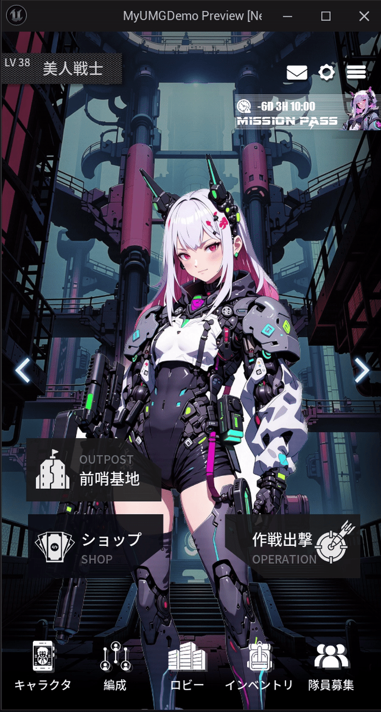
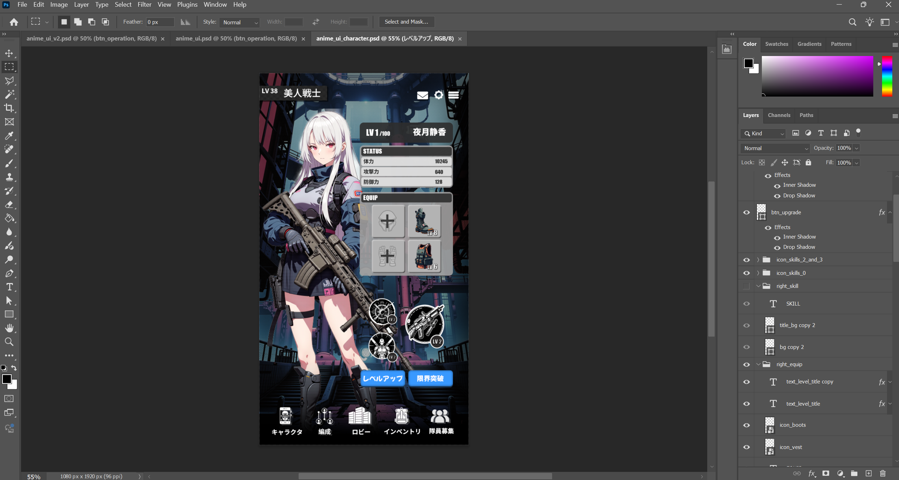
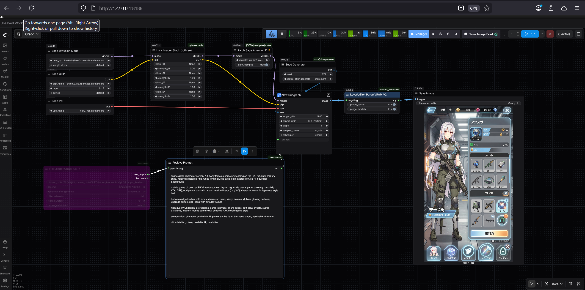
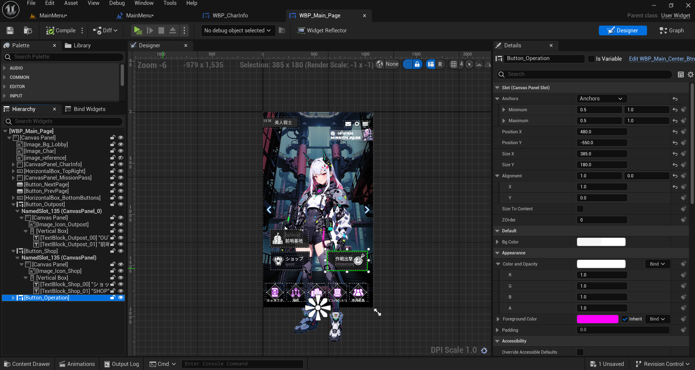

# AI-Assisted UI Implementation in Unreal Engine (UMG)

A lightweight UI production workflow combining Photoshop layout design, AI-generated assets, and Unreal Engine UMG implementation.

---

## 🎬 Demo



---

## 🧩 Overview

This project demonstrates a simple but practical UI workflow:

- Layout design in Photoshop
- Icon generation using AI tools (ComfyUI)
- Integration into Unreal Engine UMG
- Basic UI animation and material effects

---

## 🔄 Workflow

1. **Photoshop (Layout Design)**
   - Designed UI layout using layered PSD
   - Defined spacing, hierarchy, and composition



2. **AI Asset/Layout Generation**
   - Generated part of the icons using ComfyUI
   - Combined with curated external icon assets
   - Maintained visual consistency through prompt control

   **Layout Example Prompt:**

   ```text
   anime game character screen, full body female character standing on the left, futuristic military style, holding a detailed rifle, white long hair, red eyes, calm expression, sci-fi industrial background

   mobile game UI overlay, RPG interface, clean layout, right side status panel showing stats (HP, ATK, DEF), equipment slots with icons, level indicator (LV1/100), character name in Japanese style text

   bottom navigation bar with icons (character, team, lobby, inventory), blue glowing buttons, upgrade button, skill icons with circular frames

   high quality UI design, professional game interface, sharp edges, soft glow effects, subtle gradients, modern mobile game HUD, polished AAA mobile game style

   composition: character on the left, UI panels on the right, balanced layout, vertical 9:16 format

   ultra detailed, clean, readable UI, no clutter



3. **Unreal Engine (UMG Implementation)**
   - Built UI using UMG widgets
   - Organized layout using containers (Vertical Box, Overlay, etc.)



4. **Material & Animation**
   - Implemented animated flow effect using material (flow arrow)
   - UI animations (levelup pop-up)


---

## 🎯 Key Features

- Clean UI layout translated from PSD to UMG
- AI-assisted icon generation for rapid asset creation
- Real-time UI animation inside Unreal Engine
- Material-driven visual effect (flow arrow)

---

## ⚙️ Technical Details

- Engine: Unreal Engine (UMG)
- Tools: Photoshop, ComfyUI
- Techniques:
  - UI layout structuring
  - Material-based animation
  - UMG animation system

---

## ⚠️ Limitations

- Not a fully automated pipeline
- AI usage limited to asset generation (icons/backgrounds)
- No dynamic data binding or complex UI logic

---

## 📌 What I Learned

- Bridging design (PSD) and engine implementation (UMG)
- Using AI tools to speed up UI asset creation
- Implementing simple but effective UI animation in Unreal

---
