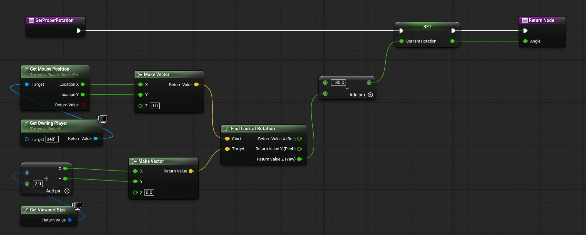
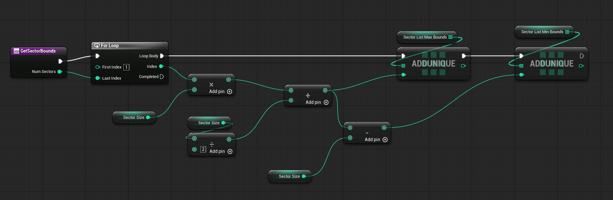
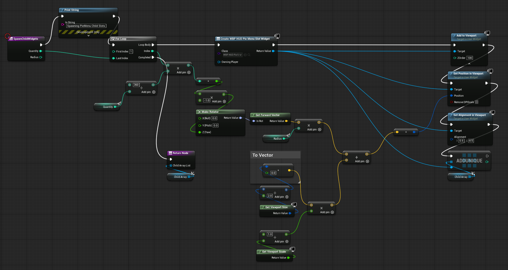
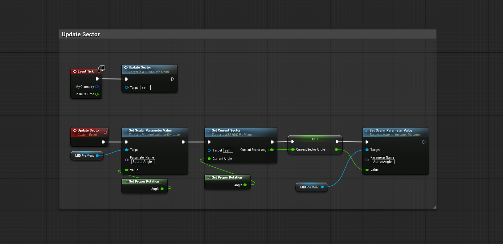
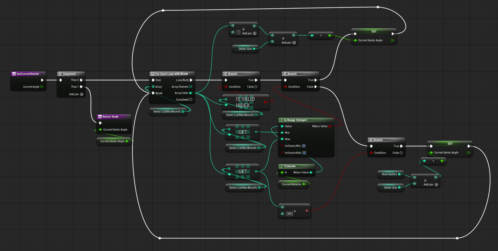

# Dynamic Radial Menu System (UE4/UE5)

## 1. Project Overview
This project is a high-performance, scalable **Radial Menu (Pie Menu)** system developed for Unreal Engine. It utilizes dynamic mathematical layouts, real-time material feedback, and a decoupled architecture via Blueprint Interfaces to ensure it can be integrated into any game genre, such as RPGs or survival builders.

## 2. Core Technical Stack
*   **Unreal Engine Blueprints**: Core logic and event handling.
*   **UMG (Unreal Motion Graphics)**: UI rendering and slot management.
*   **Vector Mathematics**: Polar coordinate conversion and trigonometric positioning.
*   **Blueprint Interfaces (BPI)**: Facilitating communication between the menu and interactable world objects.

---

## 3. Mathematical Foundations & Algorithms

### A. Polar Coordinate Conversion (`GetProperRotation`)

To determine which sector the user is highlighting, the system converts the mouse position into an angular value relative to the center of the viewport.

*   **Logic**: The function constructs two vectors — one from the **Mouse Position** and one from the **Viewport Center** — and uses `Find Look at Rotation` to compute the directional angle between them.
*   **Angle Extraction**: The resulting **Yaw** value is used as the primary angular measurement.
*   **Offset Adjustment**: A **+180-degree offset** is applied to align the direction into a consistent `[0, 360]` range.
*   **Purpose**: This angle serves as the core input for sector detection in the radial menu system.

*   **Implementation**: Refer to the image for the blueprint logic.

### B. Dynamic Sector Calculation (`GetSectorBounds`)

The system dynamically calculates the angular range of each radial menu sector based on the total number of menu items.

*   **Sector Size**: Each sector is evenly divided using `360 / NumSectors`.
*   **Loop-Based Generation**: A `For Loop` iterates through each sector index and calculates its angular center.
*   **Boundary Calculation**: For each sector, the system stores a minimum and maximum angle by subtracting and adding half of the sector size.
*   **Runtime Usage**: These precomputed bounds are later used by `GetCurrentSector` to determine which menu item is currently highlighted.

*   **Implementation**: Refer to the image for the boundary calculation blueprint.

## 4. System Architecture

### A. Dynamic UI Layout (`SpawnChildWidgets`)

Child widgets are dynamically spawned and arranged in a circular layout based on the number of menu items.

*   **Angle Distribution**: Each widget is assigned an angle using `360 / Quantity * Index`, ensuring even spacing around the circle.
*   **Directional Calculation**: A `Rotator` is constructed from the angle, and `Get Forward Vector` is used to derive the direction.
*   **Positioning**: The final position is calculated by offsetting the viewport center with the direction vector scaled by a configurable radius.
*   **Alignment**: Widgets are centered using an alignment of `(0.5, 0.5)` to ensure proper radial placement.
*   **Management**: Each spawned widget is stored in a `Child Array` using `AddUnique` for later updates and cleanup.

*   **Implementation**: Refer to the image for the spawning logic.

### B. Real-time Visual Feedback (`UpdateSector`)

The radial menu updates its visual feedback in real time based on the current mouse direction.

*   **Tick Update**: The `UpdateSector` event is called every frame while the radial menu is active.
*   **Search Angle**: The system uses `GetProperRotation` to calculate the current mouse angle and sends it to the material parameter `SearchAngle`.
*   **Sector Detection**: `GetCurrentSector` compares the current angle against the precomputed sector bounds to identify the active sector.
*   **Active Angle**: Once a sector is detected, the system stores its center angle as `CurrentSectorAngle`.
*   **Material Feedback**: The calculated active sector angle is sent to the dynamic material instance through the `ActiveAngle` parameter.

*   **Implementation**: Refer to images for the update logic and the sector detection logic.

### C. Decoupled Communication (`BPI_PieMenu`)
The system uses the `BPI_PieMenu` interface to interact with the game world without hard-coding references.
*   **Core Functions**: Includes `UpdateInteractable`, `ShowOutline`, and `Interact` to handle different object types (Consumables, Weapons, etc.).
*   **Implementation**: Refer to the image for the interface structure.

---

## 5. Performance & Optimization
*   **Pre-calculation**: Sector bounds are calculated during `Preconstruct` rather than every frame to save CPU cycles.
*   **Resource Management**: The system uses `AddUnique` for array management to prevent duplicate references.
*   **Memory Safety**: Explicitly clears the `Child Array List` and resets the `Active Consumable` during destruction to ensure no dangling references.